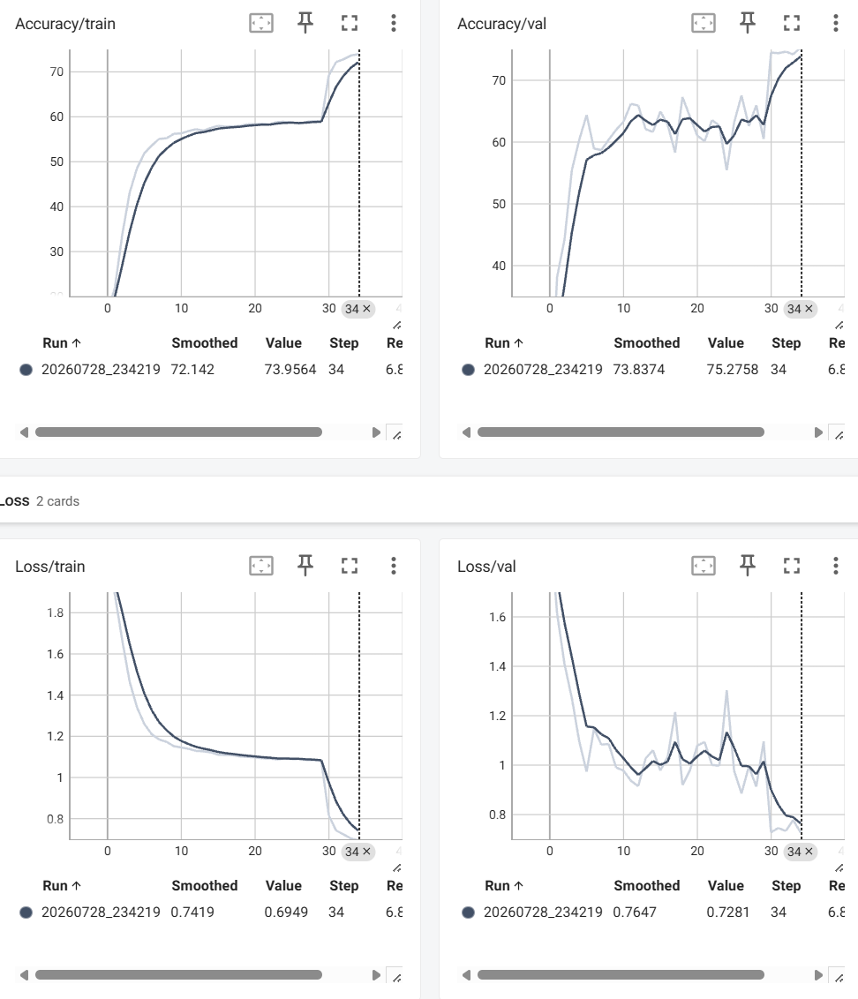

# Jetson Emotion Detector

A real-time facial-expression detector built on the NVIDIA Jetson Orin Nano. It detects the largest face in a camera frame and classifies it as angry, disgust, fear, happy, neutral, sad, or surprise.

This project is the first stage of a larger debate body-language analysis system.


## The Algorithm

The project uses two neural networks:

1. FaceNet detects faces in the camera frame.
2. A custom ResNet-18 model classifies the expression of the largest detected face.

The pipeline is:

```text
USB camera
    ↓
FaceNet detects faces
    ↓
The largest face is selected and cropped
    ↓
ResNet-18 classifies the expression
    ↓
The label and confidence are displayed
```

I trained the classifier using the FERPlus dataset.

I initially trained an eight-class model that included contempt. During testing, contempt was frequently confused with other expressions. I removed the contempt class and retrained the model with seven classes.

The final model reached:


Best epoch:          34
Training accuracy:   73.9564%
Validation accuracy: 75.2758%
Validation loss:     0.72810



The model was exported to ONNX and runs with GPU acceleration through NVIDIA Jetson Inference, CUDA, and TensorRT.

Main dependencies:

* NVIDIA Jetson Orin Nano
* USB camera
* NVIDIA Jetson Inference
* Python 3
* PyTorch
* Torchvision
* CUDA
* TensorRT
* ONNX
* FaceNet
* Git LFS

Current limitations:

* It classifies only the largest detected face.
* Accuracy may decrease with poor lighting, blur, head rotation, or partial face coverage.
* Similar expressions may be confused.
* It detects visible facial expressions only. It cannot determine a person’s true emotions or intentions.
* Running FaceNet and ResNet-18 sequentially can create some delay.

## Running This Project

1. Clone the repository.

```bash
git clone git@github.com:peter-xu261/Emotion-detector.git
cd Emotion-detector
```

2. Install Git LFS and download the model files.

```bash
sudo apt update
sudo apt install -y git-lfs
git lfs install
git lfs pull
```

3. Install NVIDIA Jetson Inference if it is not already installed.

```bash
cd ~

git clone --recursive \
  https://github.com/dusty-nv/jetson-inference

cd jetson-inference

mkdir build
cd build

cmake ../
make -j$(nproc)

sudo make install
sudo ldconfig
```

4. Enable Jetson performance mode.

```bash
sudo nvpmodel -m 0
sudo jetson_clocks
```

5. Set the model path.

```bash
NET="$HOME/jetson-inference/python/training/classification/models/emotions7_v2"
```

6. Run the live emotion detector.

```bash
DISPLAY=:0 python3 "$HOME/jetson-inference/live_emotion.py" \
  /dev/video0 \
  display://0 \
  --model="$NET/resnet18.onnx" \
  --labels="$NET/labels.txt" \
  --input-blob=input_0 \
  --output-blob=output_0 \
  --face-network=facenet \
  --face-threshold=0.15 \
  --emotion-threshold=0.05 \
  --padding=0.05 \
  --smoothing=5 \
  --classify-every=2 \
  --input-width=640 \
  --input-height=480 \
  --input-rate=20
```

Press `Ctrl+C` to stop the program.

video link: 
https://www.youtube.com/watch?v=bqBORXbHjxE 

